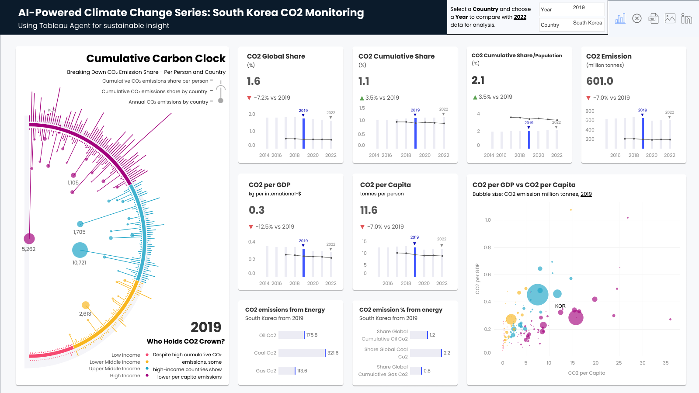
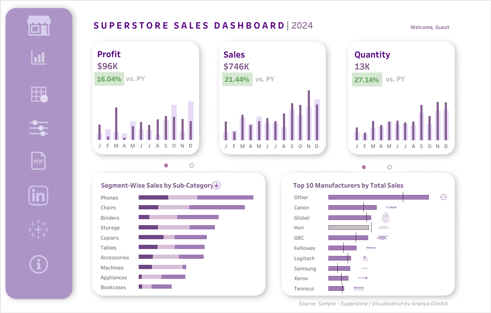
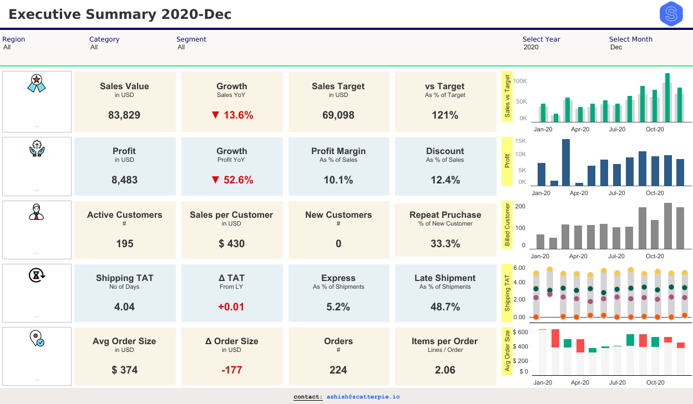
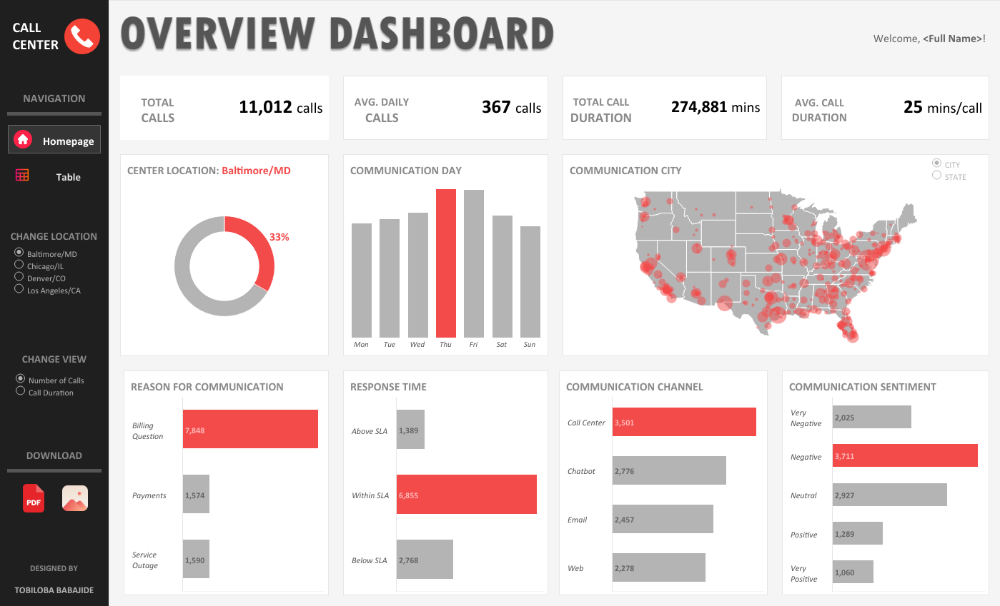
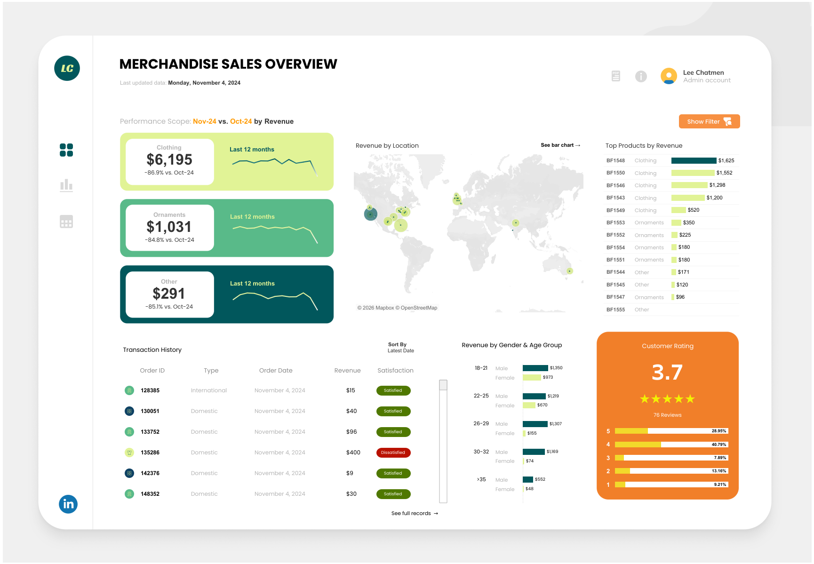

## Agenda {background-color="#f1f5f9"}

🎯 About Dashboards

📐 Design Thinking & Key Principles

🎨 Best Practices

🛠️ Dashboard Development Environment

🌐 Hands On: SEAWeather

# Which Dashboard Helps You *Make Decisions* Faster?  {background="#43464B" style="font-size: 0.7em;"}

##

{fig-align="center" width="1000"}

::: footer
[Tableau Agent Climate Dashboard](https://public.tableau.com/app/profile/harim.jung/viz/GlobalCODashboardPoweredbyTableauAgent/TableauAgentClimateDashboard)
:::

##

{fig-align="center" width="1000"}

::: footer
[Tableau Superstore Sales Dashboard](https://public.tableau.com/app/profile/ananya.dikshit/viz/SuperstoreSalesandOrdersDashboard-TheBarChartWay/Dashboard2)
:::

## How This Dashboard Helps Users:{.scrollable}

::: {.columns}
::: {.column .fragment width="50%"}

```{=html}
<div style="background: #fff; border: 2px solid #dc3545;
     border-radius: 8px; padding: 5px; text-align: center;
     min-height: 331px; display: flex; align-items: center;
     justify-content: center; color: #6c757d;">
     
</div>
```

::: incremental
::: {style="font-size: 0.7em;"}
- **Key headline (e.g. North Korea)**: CO₂ per capita 11.6t, down from 2019; CO₂ per GDP 0.3t, also slightly down.
- **Driving factor**: The "Emissions from Energy" chart shows coal with the largest share
- **Action**: Shift energy sources to cleaner alternatives, such as solar or wind
:::
:::
:::

::: {.column .fragment width="50%"}

```{=html}
<div style="background: #fff; border: 2px solid #198754;
     border-radius: 8px; padding: 5px; text-align: center;
     min-height: 200px; display: flex; align-items: center;
     justify-content: center; color: #6c757d;">
     
</div>
```
::: incremental
::: {style="font-size: 0.7em;"}
- **Key metric**: Sales $746K and Profit $96K, both up year-over-year
- **Deeper detail**: The "Sub-Category" chart shows Chairs and Phones with the largest growth
- **Action**: Reorder top-selling products, run promotions on Bookcases whose sales are declining
:::
:::
:::
:::

---

## Why Do Dashboards Matter? {.center}

::: {style="font-size: 0.8em; text-align: center;" .fragment}
> "Dashboards sit between __questions__ and __decisions__.
> When working well, the team asks 'What patterns/trends are visible?', and within seconds can perform analysis or make decisions.
> When it doesn't work, the team tends to search and guess"
:::

. . .

::: {style="font-size: 1em;text-align: center; margin-top: 30px;"}
**Data → Decision: without a dashboard, how long does it take?**
:::

. . .

::: {style="font-size: 0.8em; text-align: center; margin-top: 30px;"}
`collect` → `clean` → `model` → `transform` → **`encode (visualise)`**
:::

. . .

::: {style="font-size: 0.9em;" }
*This pipeline is the core of every data product — the dashboard sits at the end ("encode").*
:::

::: footer
[Josep Ferrer, Freelance Data Scientist, 2025](https://www.datacamp.com/tutorial/dashboard-design-tutorial)
:::


# What Is a Dashboard?  {background="#43464B" style="font-size: 0.8em;"}

## Dashboard = Communication Tool, Not Just a Data Display {style="font-size: 0.8em;"}

::: {.columns}
::: {.column .fragment width="55%"}
```{=html}
<br>
<div style="background:#cfe2ff; border-radius:10px; padding:18px; border-left:4px solid #0d6efd;">
  <div style="font-size:1em; font-weight:500; color:#212529; margin-bottom:14px;">
    Operational Definition
    <span style="font-size:0.5em; font-weight:200; color:#6c757d; display:block; margin-top:2px;">
      Adapted from Few (2013) &amp; Knaflic (2015)
    </span>
  </div>
  <div style="display:flex; flex-direction:column; gap:8px; font-size:0.8em;">
    <div style="background:#fff; border-radius:8px; padding:10px 12px; border:1px solid #9ec5fe;">
      <span style="color:#0d6efd; font-weight:600;">Data visualization</span>
      <span style="color:#495057;"> designed to support decisions</span>
    </div>
    <div style="background:#fff; border-radius:8px; padding:10px 12px; border:1px solid #9ec5fe;">
      <span style="color:#dc3545; font-weight:600;">Not</span>
      <span style="color:#495057;"> displaying all data — only </span>
      <span style="color:#0d6efd; font-weight:600;">what is important & relevant</span>
    </div>
    <div style="background:#fff; border-radius:8px; padding:10px 12px; border:1px solid #9ec5fe;">
      <span style="color:#495057;">Delivering </span>
      <span style="color:#0d6efd; font-weight:600;">a clear message</span>
      <span style="color:#495057;"> to the right audience</span>
    </div>
  </div>
</div>
```
:::

::: {.column .fragment width="45%"}
```{=html}
<br>
```
**Three main functions:**

::: {.incremental style="font-size: 0.8em;"}
- 📢**Deliver the message**: one shared perspective
- ❓**Answer key questions**: frequently asked, answered automatically
- ⚡**Support decision-making**: from "What changed?" directly to *action*
:::
:::
:::

. . .

::: {.callout-tip title="Daily Car Dashboard Example" style="font-size: 0.8em;"}
Do you need to know how many liters of fuel have been used?<br/>
You only need to know: **is there enough to reach the destination or not?**
Not every number — **the right number, at the right time.**

*"There is a story in your data. But your tools don't know what that story is."*<br/>Cole Nussbaumer Knaflic, **Storytelling with Data** (2015)
:::


---

## Dashboard vs Report vs Apps {.center}

:::{ .fragment}
```{=html}
<div style="overflow-x:auto;">
<table style="width:100%; border-collapse:collapse; font-size:0.82em; border-radius:10px; overflow:hidden; box-shadow:0 2px 8px rgba(0,0,0,0.08);">
  <thead>
    <tr style="background:#0d6efd; color:white;">
      <th style="padding:12px 16px; text-align:left;">Dimension</th>
      <th style="padding:12px 16px; text-align:center;">📊 Dashboard</th>
      <th style="padding:12px 16px; text-align:center;">📄 Report</th>
      <th style="padding:12px 16px; text-align:center;">📱 Apps</th>
    </tr>
  </thead>
  <tbody>
    <tr style="background:#fff;">
      <td style="padding:10px 16px; font-weight:600; color:#495057;">Update</td>
      <td style="padding:10px 16px; text-align:center; color:#198754; font-weight:500;">Real-time / Automatic</td>
      <td style="padding:10px 16px; text-align:center; color:#6c757d;">Periodic / Manual</td>
      <td style="padding:10px 16px; text-align:center; color:#198754; font-weight:500;">Real-time</td>
    </tr>
    <tr style="background:#f8f9fa;">
      <td style="padding:10px 16px; font-weight:600; color:#495057;">Interactivity</td>
      <td style="padding:10px 16px; text-align:center; color:#0d6efd;">Medium</td>
      <td style="padding:10px 16px; text-align:center; color:#dc3545;">Low</td>
      <td style="padding:10px 16px; text-align:center; color:#198754; font-weight:500;">High</td>
    </tr>
    <tr style="background:#fff;">
      <td style="padding:10px 16px; font-weight:600; color:#495057;">Purpose</td>
      <td style="padding:10px 16px; text-align:center; color:#0d6efd;">Monitor & Decisions</td>
      <td style="padding:10px 16px; text-align:center; color:#6c757d;">Documentation</td>
      <td style="padding:10px 16px; text-align:center; color:#6f42c1;">Transaction / Action</td>
    </tr>
    <tr style="background:#f8f9fa;">
      <td style="padding:10px 16px; font-weight:600; color:#495057;">Example</td>
      <td style="padding:10px 16px; text-align:center; color:#6c757d;">Google Analytics</td>
      <td style="padding:10px 16px; text-align:center; color:#6c757d;">Annual Report</td>
      <td style="padding:10px 16px; text-align:center; color:#6c757d;">Tokopedia</td>
    </tr>
  </tbody>
</table>
</div>
```
:::

---


## Why Use a Dashboard?

:::{.fragment style="font-size: 0.65em;"}
> *"A visual display of the most important information needed to achieve one or more objectives; consolidated and arranged on a single screen so the information can be monitored at a glance."*<br/><br/>
> Stephen Few, **Information Dashboard Design** (2013, 2nd ed.)
:::

:::{.fragment style="font-size: 0.8em;"}
```{=html}
<div style="display:grid; grid-template-columns:repeat(2,1fr); gap:14px; margin-top:8px;">
  <div style="background:#cfe2ff; border-radius:10px; padding:12px; border-top:3px solid #0d6efd;">
    <div style="font-size:1.5em; margin-bottom:8px;">⏱️</div>
    <div style="font-weight:700; color:#212529; margin-bottom:6px;">Real-Time Monitoring</div>
    <div style="color:#495057; font-size:0.88em; line-height:1.5;">Monitor current conditions without waiting for reports. Anomalies detected in seconds, not days.</div>
  </div>
  <div style="background:#d1e7dd; border-radius:10px; padding:12px; border-top:3px solid #198754;">
    <div style="font-size:1.5em; margin-bottom:8px;">⚡</div>
    <div style="font-weight:700; color:#212529; margin-bottom:6px;">Accelerate Decisions</div>
    <div style="color:#495057; font-size:0.88em; line-height:1.5;">From <em>searching for data</em> first, to <em>making decisions right now</em>. Context immediately available on one screen.</div>
  </div>
  <div style="background:#e2d9f3; border-radius:10px; padding:12px; border-top:3px solid #6f42c1;">
    <div style="font-size:1.5em; margin-bottom:8px;">🔍</div>
    <div style="font-weight:700; color:#212529; margin-bottom:6px;">Interactive & Exploratory</div>
    <div style="color:#495057; font-size:0.88em; line-height:1.5;">Users can filter, drill-down, zoom, and ask questions independently without relying on analysts.</div>
  </div>
  <div style="background:#fff3cd; border-radius:10px; padding:12px; border-top:3px solid #fd7e14;">
    <div style="font-size:1.5em; margin-bottom:8px;">🤝</div>
    <div style="font-weight:700; color:#212529; margin-bottom:6px;">Self-Service Analytics</div>
    <div style="color:#495057; font-size:0.88em; line-height:1.5;">Non-technical teams can answer data questions themselves. Analysts focus on insights, not requests.</div>
  </div>
</div>
```
:::


## Three Types of Dashboards

:::{.fragment}
```{=html}
<div style="display:grid; grid-template-columns:repeat(3,1fr); gap:12px; margin-top:8px;">

  <div style="background:#fff; border-radius:12px; padding:18px;
       box-shadow:0 2px 12px rgba(13,110,253,0.10); border-top:4px solid #0a58ca;">
    <div style="display:flex; align-items:center; gap:5px; margin-bottom:14px;">
      <span style="font-size:1.5em;">🎯</span>
      <div>
        <div style="font-weight:700; color:#212529;">Executive</div>
        <div style="font-size:0.75em; color:#6f42c1; font-weight:600; text-transform:uppercase; ">Strategic</div>
      </div>
    </div>
    <div style="display:flex; flex-direction:column; gap:6px; font-size:0.6em; color:#495057;">
      <div><span style="color:#0a58ca; font-weight:600;">Focus:</span> Long-term direction & goals</div>
      <div><span style="color:#0a58ca; font-weight:600;">Data:</span> High-level summary (KPIs)</div>
      <div><span style="color:#0a58ca; font-weight:600;">Update:</span> Weekly / Monthly</div>
      <div><span style="color:#0a58ca; font-weight:600;">User:</span> C-Level, Directors</div>
    </div>
    <div style="margin-top:12px; background:#cfe2ff; border-radius:6px; padding:8px 10px; font-size:0.68em; color:#0a58ca;">
      💡 Revenue, ROI, Market Share, NPS
    </div>
  </div>

  <div style="background:#fff; border-radius:12px; padding:18px;
       box-shadow:0 2px 12px rgba(25,135,84,0.10); border-top:4px solid #198754;">
    <div style="display:flex; align-items:center; gap:5px; margin-bottom:14px;">
      <span style="font-size:1.5em;">⚡</span>
      <div>
        <div style="font-weight:700; color:#212529;">Operational</div>
        <div style="font-size:0.75em; color:#198754; font-weight:600; text-transform:uppercase; ">Real-Time</div>
      </div>
    </div>
    <div style="display:flex; flex-direction:column; gap:6px; font-size:0.6em; color:#495057;">
      <div><span style="color:#198754; font-weight:600;">Focus:</span> Daily monitoring, anomalies</div>
      <div><span style="color:#198754; font-weight:600;">Data:</span> Real-time, live feed</div>
      <div><span style="color:#198754; font-weight:600;">Update:</span> Seconds / Minutes</div>
      <div><span style="color:#198754; font-weight:600;">User:</span> Operations Manager</div>
    </div>
    <div style="margin-top:12px; background:#d1e7dd; border-radius:6px; padding:8px 10px; font-size:0.68em; color:#198754;">
      💡 Inventory, Response Time, <strong>SEAWeather ← demo!</strong>
    </div>
  </div>

  <div style="background:#fff; border-radius:12px; padding:22px;
       box-shadow:0 2px 12px rgba(111,66,193,0.10); border-top:4px solid #6f42c1;">
    <div style="display:flex; align-items:center; gap:5px; margin-bottom:14px;">
      <span style="font-size:1.5em;">🔍</span>
      <div>
        <div style="font-weight:700; color:#212529;">Analytical</div>
        <div style="font-size:0.75em; color:#6f42c1; font-weight:600; text-transform:uppercase;">Deep Dive</div>
      </div>
    </div>
    <div style="display:flex; flex-direction:column; gap:6px; font-size:0.6em; color:#495057;">
      <div><span style="color:#6f42c1; font-weight:600;">Focus:</span> Deep analysis, trends</div>
      <div><span style="color:#6f42c1; font-weight:600;">Data:</span> Historical, detailed, exploratory</div>
      <div><span style="color:#6f42c1; font-weight:600;">Update:</span> Daily / Weekly</div>
      <div><span style="color:#6f42c1; font-weight:600;">User:</span> Data Analyst, Researcher</div>
    </div>
    <div style="margin-top:12px; background:#e2d9f3; border-radius:6px; padding:8px 10px; font-size:0.68em; color:#6f42c1;">
      💡 Segmentation, Disease Trends, Cohort
    </div>
  </div>
</div>
```
:::

::: {.callout-important style="margin-top:16px;" .fragment}
**There is no universal dashboard.** The wrong type = accurate data but the dashboard doesn't fit the need.
Always start with: *Who is the user? What question needs to be answered? How often should it update?*

Classification adapted from Few's typology (2013) and widely used in the Business Intelligence (BI) industry.
:::


## Strategic Dashboard

{fig-align="center" width="1000"}

::: footer
[Monthly Executive Summary](https://public.tableau.com/app/profile/scatterpie.analytics/viz/MonthlyExecutiveDashboard_16083589293530/ExecutiveSummary)
:::

## Operational Dashboard

{fig-align="center" width="1000"}

::: footer
[Call Center Dashboard](https://public.tableau.com/app/profile/tobiloba.babajide/viz/CallCenterDashboard_17110607427650/CallCenterDashboard)
:::

## Analytical Dashboard

{fig-align="center" width="1000"}

::: footer
[Merchandise Sales Dashboard](https://public.tableau.com/app/profile/gandes.goldestan/viz/MerchandiseSalesDashboard_17490129386740/Overview)
:::


# Design Thinking & Key Principles  {background="#43464B" style="font-size: 0.8em;"}

---

## Key Principle: Start from the User, Not the Data {.scrollable}

::: {.columns}
::: {.column width="50%" .fragment}
```{=html}
<br>
<div style="background:#fff3cd; border-radius:10px; padding:16px; border-left:4px solid #fd7e14; margin-bottom:16px;">
  <div style="font-weight:500; color:#fd7e14; margin-bottom:6px;">❌ Data-Centric Approach</div>
  <div style="color:#495057; font-size:0.6em; line-height:1.6;">
    "We have lots of data, display it all."<br>
    → Dashboard overloaded, nothing readable.<br>
    → User confused, hard to make decisions.
  </div>
</div>
<div style="background:#d1e7dd; border-radius:10px; padding:16px; border-left:4px solid #198754;">
  <div style="font-weight:500; color:#198754; margin-bottom:6px;">✅ User-Centric Approach</div>
  <div style="color:#495057; font-size:0.6em; line-height:1.6;">
    "User needs to make decision A — what data supports that?"<br>
    → Dashboard focused on what's relevant only.<br>
    → User understands, decisions made quickly.
  </div>
</div>
```
:::

::: {.column width="50%" .fragment style="font-size:0.7em;"}
```{=html}
<br>
```
> *A good dashboard is not the one that displays all available data, but the one that answers the most frequently asked questions in the fastest way possible to understand.*

:::{.fragment}
**Implications:**

- Before coding, **interview users first**
- Before choosing a chart, **define the question**
- Before styling, **make sure the functionality is correct first**
:::

:::
:::

---

## Design Thinking: 5 Stages of Building a Dashboard

```{=html}
<br>
<div style="display:flex; gap:0; margin:12px 0; font-family:sans-serif;">

  <div style="flex:1; background:#cfe2ff; padding:18px 14px; border-radius:10px 0 0 10px; border-top:4px solid #0d6efd; position:relative;">
    <div style="font-size:1.2em; margin-bottom:6px;">🤝</div>
    <div style="font-weight:700; color:#0a58ca; font-size:0.9em;">1. Empathize</div>
    <div style="color:#495057; font-size:0.6em; margin-top:6px; line-height:1.5;">
      Understand user needs.<br>
      Interview & observe.<br>
      <em>"What decisions do you make most often?"</em>
    </div>
  </div>

  <div style="flex:1; background:#d1e7dd; padding:18px 14px; border-top:4px solid #198754; position:relative;">
    <div style="font-size:1.2em; margin-bottom:6px;">🎯</div>
    <div style="font-weight:700; color:#146c43; font-size:0.9em;">2. Define</div>
    <div style="color:#495057; font-size:0.6em; margin-top:6px; line-height:1.5;">
      Define the core problem.<br>
      Focus on the <strong>decision</strong> to be made.<br>
      <em>"One most important question."</em>
    </div>
  </div>

  <div style="flex:1; background:#fff3cd; padding:18px 14px; border-top:4px solid #fd7e14; position:relative;">
    <div style="font-size:1.2em; margin-bottom:6px;">💡</div>
    <div style="font-weight:700; color:#b45309; font-size:0.9em;">3. Ideate</div>
    <div style="color:#495057; font-size:0.6em; margin-top:6px; line-height:1.5;">
      Brainstorm design & KPIs.<br>
      Freely, without constraints first.<br>
      <em>Sketch on paper, don't code yet.</em>
    </div>
  </div>

  <div style="flex:1; background:#e2d9f3; padding:18px 14px; border-top:4px solid #6f42c1; position:relative;">
    <div style="font-size:1.2em; margin-bottom:6px;">🔧</div>
    <div style="font-weight:700; color:#59359a; font-size:0.9em;">4. Prototype</div>
    <div style="color:#495057; font-size:0.6em; margin-top:6px; line-height:1.5;">
      Create a dashboard draft.<br>
      Focus on <strong>function</strong>, not perfect appearance.<br>
      <em>Done is better than perfect.</em>
    </div>
  </div>

  <div style="flex:1; background:#f8d7da; padding:18px 14px; border-radius:0 10px 10px 0; border-top:4px solid #dc3545; position:relative;">
    <div style="font-size:1.2em; margin-bottom:6px;">🧪</div>
    <div style="font-weight:700; color:#b02a37; font-size:0.9em;">5. Test</div>
    <div style="color:#495057; font-size:0.6em; margin-top:6px; line-height:1.5;">
      Test with key users.<br>
      Iterate based on feedback.<br>
      <em>The best dashboard = the one revised most often.</em>
    </div>
  </div>

</div>
```

::: {.callout-note}
Design Thinking is not a linear process — **Empathize and Test can occur repeatedly** before the dashboard is deemed fit for purpose.
:::

---


## Effective Dashboards: From Insight to Action {.scrollable style="font-size:0.8em;"}

::: {.columns}
::: {.column width="45%" .fragment}
```{=html}
<div style="background:#212529; border-radius:12px; padding:16px; color:white;">
  <div style="font-size:0.7em; font-weight:600; color:#9ec5fe; text-transform:uppercase;  margin-bottom:12px;">
    DIKW Hierarchy (Ackoff, 1989)
  </div>
  <div style="display:flex; flex-direction:column; gap:0;">
    <div style="background:#0d6efd; border-radius:8px 8px 0 0; padding:12px 16px; text-align:center;">
      <div style="font-weight:700;">DATA</div>
      <div style="font-size:0.78em; opacity:0.85;">Raw numbers from the system</div>
    </div>
    <div style="text-align:center; padding:4px; color:#adb5bd; font-size:1.2em;">↓</div>
    <div style="background:#3d8bfd; padding:12px 16px; text-align:center;">
      <div style="font-weight:700;">INFORMATION</div>
      <div style="font-size:0.78em; opacity:0.85;">Data given context</div>
    </div>
    <div style="text-align:center; padding:4px; color:#adb5bd; font-size:1.2em;">↓</div>
    <div style="background:#20c997; padding:12px 16px; text-align:center;">
      <div style="font-weight:700;">INSIGHT</div>
      <div style="font-size:0.78em; opacity:0.85;">Meaningful patterns & anomalies</div>
    </div>
    <div style="text-align:center; padding:4px; color:#adb5bd; font-size:1.2em;">↓</div>
    <div style="background:#198754; border-radius:0 0 8px 8px; padding:12px 16px; text-align:center;">
      <div style="font-weight:700;">ACTION ← ultimate goal</div>
      <div style="font-size:0.78em; opacity:0.85;">Decisions made</div>
    </div>
  </div>
  <div style="margin-top:14px; font-size:0.8em; color:#adb5bd; text-align:center; font-style:italic;">
    A dashboard cannot work effectively if it stops at "Information".
  </div>
</div>
```
:::

::: {.column width="55%" .fragment}
```{=html}
<div style="display:flex; flex-direction:column; gap:16px;">

  <div style="background:#fff; border-radius:10px; padding:0; overflow:hidden; box-shadow:0 2px 8px rgba(0,0,0,0.07);">
    <div style="background:#0d6efd; color:white; padding:10px 16px; font-weight:600; font-size:0.5em; display:flex; align-items:center; gap:8px;">
      <span>📊</span> Example 1: E-Commerce Sales
    </div>
    <div style="padding:14px 16px; display:grid; grid-template-columns:1fr 1fr; gap:9px;">
      <div style="background:#cfe2ff; border-radius:8px; padding:10px;">
        <div style="font-size:0.7em; color:#6c757d; margin-bottom:4px; font-weight:600; text-transform:uppercase;">INSIGHT</div>
        <div style="font-size:0.65em; color:#212529;">Sales always spike significantly at month-end (25th–31st)</div>
      </div>
      <div style="background:#d1e7dd; border-radius:8px; padding:12px;">
        <div style="font-size:0.7em; color:#6c757d; margin-bottom:4px; font-weight:600; text-transform:uppercase;">ACTION</div>
        <div style="font-size:0.65em; color:#212529;">Arrange stock in advance & run a promo on the 20th to warm up traffic</div>
      </div>
    </div>
  </div>

  <div style="background:#fff; border-radius:10px; padding:0; overflow:hidden; box-shadow:0 2px 8px rgba(0,0,0,0.07);">
    <div style="background:#6f42c1; color:white; padding:10px 16px; font-weight:600; font-size:0.5em; display:flex; align-items:center; gap:8px;">
      <span>🚌</span> Example 2: Public Transportation
    </div>
    <div style="padding:14px 16px; display:grid; grid-template-columns:1fr 1fr; gap:9px;">
      <div style="background:#e2d9f3; border-radius:8px; padding:10px;">
        <div style="font-size:0.7em; color:#6c757d; margin-bottom:4px; font-weight:600; text-transform:uppercase;">INSIGHT</div>
        <div style="font-size:0.65em; color:#212529;">Passenger traffic is very low between 06:00–08:00 on certain routes</div>
      </div>
      <div style="background:#d1e7dd; border-radius:8px; padding:12px;">
        <div style="font-size:0.7em; color:#6c757d; margin-bottom:4px; font-weight:600; text-transform:uppercase;">ACTION</div>
        <div style="font-size:0.65em; color:#212529;">Reduce morning frequency, redirect fleet to high-load routes</div>
      </div>
    </div>
  </div>

  <div style="background:#fff; border-radius:10px; padding:0; overflow:hidden; box-shadow:0 2px 8px rgba(0,0,0,0.07);">
    <div style="background:#fd7e14; color:white; padding:10px 16px; font-weight:600; font-size:0.5em; display:flex; align-items:center; gap:8px;">
      <span>🏥</span> Example 3: Healthcare Services
    </div>
    <div style="padding:14px 16px; display:grid; grid-template-columns:1fr 1fr; gap:9px;">
      <div style="background:#fff3cd; border-radius:8px; padding:10px;">
        <div style="font-size:0.7em; color:#6c757d; margin-bottom:4px; font-weight:600; text-transform:uppercase;">INSIGHT</div>
        <div style="font-size:0.65em; color:#212529;">Dengue cases spike every March–April in district X coinciding with the rainy season</div>
      </div>
      <div style="background:#d1e7dd; border-radius:8px; padding:12px;">
        <div style="font-size:0.7em; color:#6c757d; margin-bottom:4px; font-weight:600; text-transform:uppercase;">ACTION</div>
        <div style="font-size:0.65em; color:#212529;">Activate vector control & abate distribution from February — don't wait for cases to rise</div>
      </div>
    </div>
  </div>

</div>
```
:::
:::

---

## Key Principles: Checklist for an Actionable Dashboard

```{=html}
<br>
<div style="display:grid; grid-template-columns:1fr 1fr; gap:12px; margin-top:8px;">

  <div style="background:#fff; border-radius:10px; padding:16px; box-shadow:0 2px 8px rgba(0,0,0,0.06);">
    <div style="font-weight:700; color:#212529; margin-bottom:14px; font-size:0.8em; display:flex; align-items:center; gap:8px;">
      <span style="background:#cfe2ff; padding:4px 8px; border-radius:6px; color:#0d6efd;">✅ Relevant</span>
    </div>
    <div style="color:#495057; font-size:0.6em; line-height:1.6;">
      Every element must answer questions that users actually ask.<br><br>
      <strong>Test:</strong> <em>"If this element were removed, would the user lose important information?"</em><br>
      If not, remove it!
    </div>
  </div>

  <div style="background:#fff; border-radius:10px; padding:16px; box-shadow:0 2px 8px rgba(0,0,0,0.06);">
    <div style="font-weight:700; color:#212529; margin-bottom:14px; font-size:0.8em; display:flex; align-items:center; gap:8px;">
      <span style="background:#d1e7dd; padding:4px 8px; border-radius:6px; color:#198754;">✅ Easy to Understand</span>
    </div>
    <div style="color:#495057; font-size:0.6em; line-height:1.6;">
      The user must understand within 5 seconds without explanation.<br><br>
      <strong>Test:</strong> <em>Show it to someone who has never seen the dashboard. What is their first reaction?</em>
    </div>
  </div>

  <div style="background:#fff; border-radius:10px; padding:16px; box-shadow:0 2px 8px rgba(0,0,0,0.06);">
    <div style="font-weight:700; color:#212529; margin-bottom:14px; font-size:0.8em; display:flex; align-items:center; gap:8px;">
      <span style="background:#fff3cd; padding:4px 8px; border-radius:6px; color:#fd7e14;">✅ Actionable</span>
    </div>
    <div style="color:#495057; font-size:0.6em; line-height:1.6;">
      Every important number must lead to a decision.<br><br>
      <strong>Test:</strong> <em>"If this number goes up/down, what will the user do?"</em><br>
      If unknown, it means the question is not yet defined.
    </div>
  </div>

  <div style="background:#212529; border-radius:10px; padding:16px; box-shadow:0 2px 8px rgba(0,0,0,0.1);">
    <div style="font-weight:700; color:#9ec5fe; margin-bottom:10px; font-size:0.8em;">
      🔑 One Key Sentence
    </div>
    <div style="color:#e9ecef; font-size:0.65em; line-height:1.7; font-style:italic;">
      "An effective dashboard answers <strong style="color:#6ea8fe;">one key question</strong> very clearly, not <strong style="color:#ea868f;">all questions</strong> in a confusing way."
    </div>
  </div>

</div>
```

::: footer
Tufte (1983), Few (2013) , Knaflic (2015)
:::


# Best Practices for Building Effective Dashboards {background="#43464B" style="font-size: 0.8em;"}

## Effective Dashboards Tell a Story

::: {.columns}
::: {.column width="60%" .fragment}
```{=html}
<br>
<div style="background: #fff; border: 2px solid #dc3545;
     border-radius: 8px; padding: 5px; text-align: center;
     min-height: 300px; display: flex; align-items: center;
     justify-content: center; color: #6c757d;">
     
</div>
```
:::

::: {.column width="40%" .fragment}
```{=html}
<br>
```
:::{style="font-size:0.8em;"}
**Dashboard story arc:**

1. **Setup (KPI):** CO₂ per capita 5.2t, down vs 2019
2. **Conflict (Driver):** Oil = largest contributor
3. **Resolution (Action):** Shift to renewables, quarterly targets
:::

:::
:::

. . .

:::{style="font-size:0.7em;"}
> *"What changed? → Why? → What should we do now?"*

A **narrative approach** should be used in every dashboard development.
:::

---

## Visual Hierarchy: The Z-Pattern {.center}

```{=html}
<br>
<div style="background: #212529; border-radius: 12px;
     padding: 30px; font-family: monospace;">
  <div style="display: grid; grid-template-columns: 1fr 1fr;
       gap: 20px; color: white;">
    <div style="background: #0dcaf022; border: 2px solid #0dcaf0;
         border-radius: 8px; padding: 20px; text-align: center;">
      ① Top-Left<br><small style="color:#0dcaf0;">START — Primary KPIs</small>
    </div>
    <div style="background: #0dcaf011; border: 1px solid #0dcaf066;
         border-radius: 8px; padding: 20px; text-align: center;">
      ② Top-Right<br><small style="color:#adb5bd;">Secondary KPIs</small>
    </div>
    <div style="background: #0dcaf011; border: 1px solid #0dcaf044;
         border-radius: 8px; padding: 20px; text-align: center;">
      ③ Mid-Left<br><small style="color:#adb5bd;">Trends / Charts</small>
    </div>
    <div style="background: #ffffff11; border: 1px dashed #ffffff33;
         border-radius: 8px; padding: 20px; text-align: center;">
      ④ Bottom-Right<br><small style="color:#6c757d;">Details / Tables</small>
    </div>
  </div>
  <div style="text-align:center; margin-top: 15px;
       color: #ffc107; font-size: 0.9em;">
    ↗ Place the most important information along the Z-path, starting from the top-left corner
  </div>
</div>
```

---

## Color Principles: Signal, Not Decoration

::: {.columns}
::: {.column width="50%" .fragment}
**✅ Use color specifically for:**

- **Brand neutral** → background, border, label
- **One highlight feature** → "pay attention here!" (consistent)
- **Alert/risk** → red/orange, and only that
:::

::: {.column width="50%" .fragment}
**❌ Avoid:**

- 8+ different colors just to look "interesting"
- Rainbow chart (pie chart with 12 slices)
- Colors without consistent meaning
:::
:::

. . .

::: {.callout-warning title="Accessibility" .fragment}
8% of men experience color blindness.
Always add **icons or labels** as a secondary differentiator. Use [ColorBrewer](https://colorbrewer2.org) for accessible palettes.
:::

---

## Choose the Right Chart {.center}

| Question | ✅ Right Chart | ❌ Often Wrong |
|:-----------|:-------------:|:--------------:|
| Comparison between categories | Bar chart | Pie chart |
| Trend over time | Line chart | Stacked bar |
| Overall proportion | Stacked bar / Treemap | Pie > 5 slices |
| Data distribution | Histogram / Box plot | Regular bar |
| Relationship between two variables | Scatter plot | Line chart |
| Geographic data | Choropleth / Dot map | Region name table |
| A single key number | KPI card / Gauge | Any chart |

. . .

::: {.callout-note}
**About Pie Charts:** Humans generally struggle to compare area sizes.
More than 3–4 slices → **use a bar chart. Always.**
:::

---

## Hall of Shame: 5 Most Common Mistakes

::: {.incremental}
1. **"Dashboard as a report"** — too many numbers, no hierarchy, everything feels equally important
2. **"Chartjunk"** — gradients, 3D shadows, clipart, background images overwhelm the data
3. **"Rainbow syndrome"** — many colors without consistent meaning
4. **"Missing context"** — a number "1,247" without units, no comparison, no trend
5. **"Precision theater"** — 6 decimal places when the decision only needs a whole number
:::


# Dashboard Development Environment {background="#43464B" style="font-size: 0.8em;"}

## IDE (Integrated Development Environment): BI Tools vs Code-First {style="font-size:1.1em;"}

::: {.columns}
::: {.column width="50%" .fragment}

```{=html}
<br>
```
::: {style="font-size:0.7em; gap: 7px;"}
### 🖱️ BI Tools (No-Code/Low-Code)
- **Tableau**: comprehensive visualization, expensive
- **Power BI**: Microsoft ecosystem, enterprise
- **Metabase**: open source, self-host
- **Google Looker Studio**: Google ecosystem, free

**Best for:** business analysts, non-technical teams, standard dashboards
:::
:::

::: {.column width="50%" .fragment}
```{=html}
<br>
```
::: {style="font-size:0.7em; gap: 7px;"}
### 💻 Code-First (Python/R)
- **Streamlit**: easiest, Python
- **Dash (Plotly)**: flexible, production-grade
- **Shiny R/Python** ← used in the hands-on!
- **Observable**: JS, web-native
- **Quarto** ← used to build these slides!

**Best for:** data scientists, custom logic, ML integration
:::

:::
:::

. . .

::: {.callout-tip title="Choosing an IDE" style="font-size:0.8em;"}
Choose based on your **audience, complexity, and maintainability**.
:::


# Hands On: Building a Python Shiny Dashboard  {background="#43464B" style="font-size: 0.8em;"}

## "Hi, I'm a student looking for data on XYZ... many thanks in advance 🙏🏻" {.center}

::: {style="text-align: center; font-size: 3em; padding: 60px; color: #ffffff;"}
**2,000+**
:::

::: {style="text-align: center; font-size: 1.3em;"}
Free, open APIs, available today
curated by the global developer community
:::

. . .

::: {style="text-align: center; margin-top: 20px;"}
```{=html}
<a href="https://github.com/public-apis/public-apis"
   target="_blank"
   style="background: #0d6efd; color: #ffffff; padding: 12px 30px;
          border-radius: 6px; text-decoration: none; font-weight: bold;
          font-size: 1.1em;">
  ⭐ 421k Stars — github.com/public-apis/public-apis
</a>
```
:::

---

## API Categories {.center}

::: {style="display: grid; grid-template-columns: repeat(3, 1fr); gap: 15px; padding: 10px;"}
```{=html}
<div style="background:#fff3cd; border-left: 4px solid #fd7e14;
     padding: 15px; border-radius: 6px;">
  <strong style="color:#fd7e14;">🏥 Health</strong><br>
  <small>WHO, OpenFDA, Disease.sh<br>COVID data, vaccination, disease</small>
</div>
<div style="background:#cfe2ff; border-left: 4px solid #0d6efd;
     padding: 15px; border-radius: 6px;">
  <strong style="color:#0d6efd;">☁️ Weather ← DEMO</strong><br>
  <small>Weatherstack, Open-Meteo<br>Real-time weather, forecast</small>
</div>
<div style="background:#d1e7dd; border-left: 4px solid #198754;
     padding: 15px; border-radius: 6px;">
  <strong style="color:#198754;">🌿 Environment</strong><br>
  <small>AirVisual, NASA EONET<br>AQI, disasters, deforestation</small>
</div>
<div style="background:#fff3cd; border-left: 4px solid #ffc107;
     padding: 15px; border-radius: 6px;">
  <strong style="color:#b45309;">💹 Finance</strong><br>
  <small>Alpha Vantage, CoinGecko<br>Stocks, forex, crypto</small>
</div>
<div style="background:#e2d9f3; border-left: 4px solid #6f42c1;
     padding: 15px; border-radius: 6px;">
  <strong style="color:#6f42c1;">🏛️ Government</strong><br>
  <small>BPS API, World Bank<br>Demographics, economy</small>
</div>
<div style="background:#f8d7da; border-left: 4px solid #d63384;
     padding: 15px; border-radius: 6px;">
  <strong style="color:#d63384;">🔭 Science</strong><br>
  <small>NASA, OpenAQ<br>Asteroids, atmosphere, climate</small>
</div>
```
:::

## How to Use an API: Just 3 Steps

```python
# Step 1: Register → Get API key (email + 30 seconds)
API_KEY = "your_key_here"  # store in .env, don't hardcode!

# Step 2: Read the docs → understand the endpoint
# Example Weatherstack: GET http://api.weatherstack.com/current

# Step 3: Fetch data
import requests

response = requests.get(
    "http://api.weatherstack.com/current",
    params={"access_key": API_KEY, "query": "Jakarta"}
)

data = response.json()
print(data["current"]["temperature"])           # → 32
print(data["current"]["air_quality"]["pm2_5"])  # → 81.45  🎉
print(data["current"]["astro"]["sunrise"])      # → 06:01 AM 🎉
```

. . .

::: {.callout-tip title="Weatherstack Free Plan"}
One API call gives you: standard weather + air quality (6 pollutants) + astronomy (sunrise/sunset/moon phase)
:::


---

## From API to Dashboard

::: {.columns}
::: {.column width="60%"}
```python
# You already have this → JSON data from the API
# All that remains is:

from shiny import App, ui, render
import plotly.express as px

app_ui = ui.page_fluid(
    ui.h2("🌦️ SEAWeather"),
    ui.output_ui("weather_card"),
    ui.output_plot("aqi_chart")
)

def server(input, output, session):
    @render.ui
    def weather_card():
        # data already available from API call
        return ui.card(f"Jakarta: {data['temp']}°C")
```
:::

::: {.column width="40%"}
::: {.callout-note}
**The question is no longer:**
*"Where does the data come from?"*

**But rather:**
*"What story do you want to tell with this data?"*

And that is where the essence of an effective dashboard can be built.
:::
:::
:::

---

## API Dashboard: SEAWeather & Source Code {.center}

::: {style="text-align: center; margin-top: 20px;"}
```{=html}
<br>
<a href="https://alfnp.shinyapps.io/sea-weather/"
   target="_blank"
   style="background: #0d6efd; color: #ffffff; padding: 12px 30px;
          border-radius: 6px; text-decoration: none; font-weight: bold;
          font-size: 1.1em;">alfnp.shinyapps.io/sea-weather
</a>
```
:::

::: {style="text-align: center; margin-top: 20px;"}
```{=html}
<br>
<a href="https://github.com/alfanugraha/dashboard-101"
   target="_blank"
   style="background: #43464B; color: #ffffff; padding: 12px 30px;
          border-radius: 6px; text-decoration: none; font-weight: bold;
          font-size: 1.1em;">github.com/alfanugraha/dashboard-101
</a>
```
:::


# Hope It Was Useful — Thank You! {background="#43464B" style="font-size: 0.8em;"}
